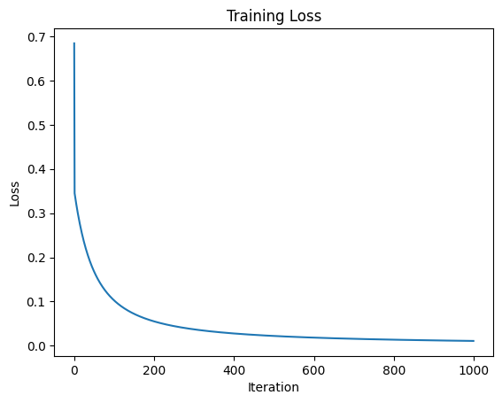
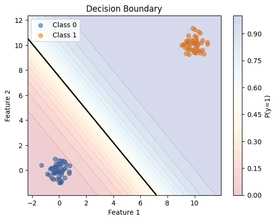
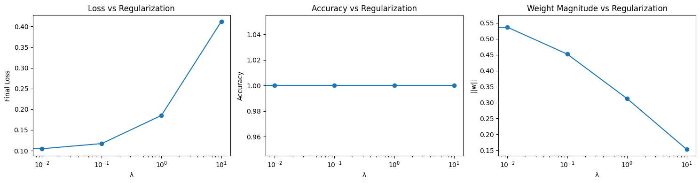

# Logistic Regression
## What did I implement?
I implemented logistic regression from scratch.

## Key insight
Negative log likelihood is cross entropy loss! Multi-class classification is just an extrapolation of everything in logistic regression -- logistic regression is like binary class case.
Realizing how the loss function is derived is also a huge win.

## Visualizations

## Aha moment
Honestly, once I was able to rederive the derivatives from hand by myself, that was a serious aha moment that made everything else click. Learning that the derivative was as clean as the difference between the predicted_y and the y was actually such a lightbulb moment. And realizing why the regularization correlated with high loss was also a critical component, since regularization just now creates a trade-off between optimizing for low cross-entropy loss or low weight magnitudes. Since the data I synthesized was so cleanly separable, adding regularization didn't help with "reducing overfitting," but I can understand how it would be critical for situations with noisy data.

